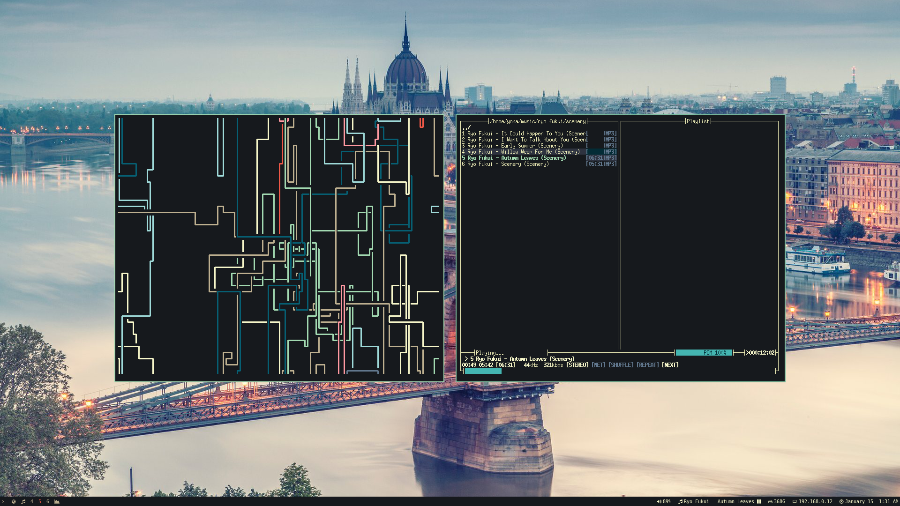

# Dotfiles by Jonah Mania

## Installation
1. Clone this repository into your home directory `git clone https://github.com/JonahMania/dotfiles`
2. Create symlinks with stow. For example to link vim `$ stow vim`

## Programs
* i3-gaps
* i3blocks
* i3lock
* feh
* vim
* firefox
* ranger
* rofi
* urxvt
* moc
* htop
